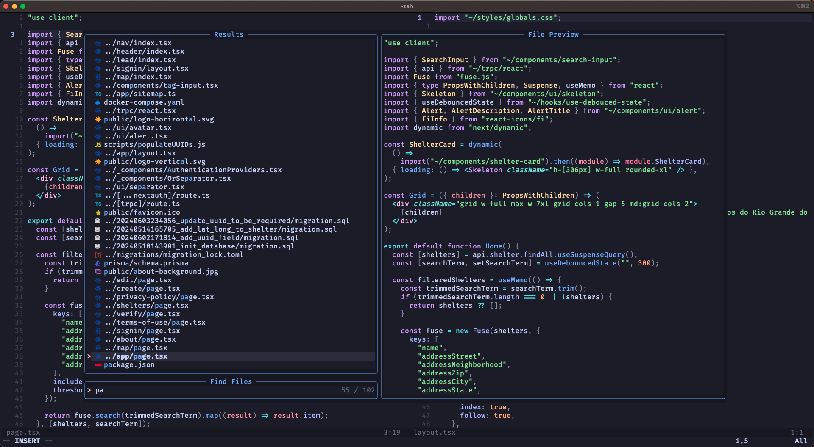

# Neovim Config

This repository serves as my personal Neovim configuration setup, tailored to enhance my development workflow. It includes various plugins, settings, and custom key mappings designed to improve productivity and streamline coding tasks. Below, you'll find detailed explanations of the key components and instructions for setting up the configuration on your own machine.

## ✨ Features and Plugins

- Pre-configured [key mappings](./lua/emiliosheinz/core/keymap.lua), [options](./lua/emiliosheinz/core/options.lua), and [commands](./lua/emiliosheinz/core/commands.lua)
- [Catppuccin](https://github.com/catppuccin/nvim) color scheme 🤩
- [lazy.nvim](https://github.com/folke/lazy.nvim) for easy and performant plugin management
- [telescope.nvim](https://github.com/nvim-telescope/telescope.nvim) for fuzzy file searching
- [Harpoon](https://github.com/ThePrimeagen/harpoon) to navigate with just a few keystrokes
- Excellent file explorer provided by [nvim-tree](https://github.com/nvim-tree/nvim-tree.lua)
- [none-ls](https://github.com/nvimtools/none-ls.nvim) for seamless integration with linters and formatters
- [mason.nvim](https://github.com/williamboman/mason.nvim) and [nvim-lspconfig](https://github.com/neovim/nvim-lspconfig) for easy installation and management of LSP servers
- [nvim-cmp](https://github.com/hrsh7th/nvim-cmp) for great completions and snippets
- Simple but powerful terminal UI for git commands with [lazygit.nvim](https://github.com/kdheepak/lazygit.nvim)
- And much more 🚀

## ⚡️ Requirements

- Neovim >= 0.10.0
- Git >= 2.19.0 (for cloning this repo)
- a [Nerd Font](https://www.nerdfonts.com/) (optional, but needed to display some icons)
- lazygit (if you want to use lazygit)
- a **C** compiler for nvim-treesitter. See [this](https://github.com/nvim-treesitter/nvim-treesitter#requirements) for more information
- [ripgrep](https://github.com/BurntSushi/ripgrep) for telescope.nvim
- [iTerm2](https://iterm2.com/) or any terminal that supports true color and undercurl
    
